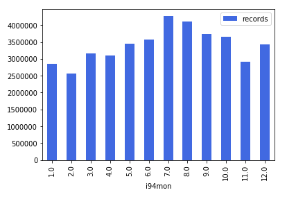

# Enhanced i94 (i94e) Datalake for Analytical Teams

Author: Johnny Chan | Data Engineer | Github: atlas7 |

This project creates a proof-of-concept (POC) data lake for analysts to analyse the immigration and visiting patterns into and out of the USA easily. The primary i94 immigration dataset contains over 40 million rows of i94 arrival records to analyse (or roughly 3.3 million rows per month for the 12 months dyrubg 2016). This datalake is called i94e (stands for i94 Enhanced Datalake) - it contains the core fields the original i94 datasets, plus additional new features to make life easier for analysts to discover insights. 

Please see the overarching Jupyter Notebook [Capstone_Project_Summary.ipynb](./Capstone_Project_Summary.ipynb) for an overviews, background context, data dictionary, and insights.

Below are steps for you to reproduce results from the lens of a data engineer, as well as an analyst.

This repo is a result of the Udacity Data Engineering Nanodegree Capstone project. My focus are: Spark, PySpark, Python, Distributed Computing.

# Data Engineer: How to build the i94e Datalake

There are two ways to run the scripts:

1. via Jupyter Notebook: this is good for initial learning and prototyping. I'd remmend you to have a read of the overarching `Capstone_Project_Summary.ipynb`. It is effectively a rapid prototype of the ETL python scripts and contains documentations such as EDA and insight gathering. This notebook motivates the design of the Python Scripts.
2. via Standalone Python scripts. At the end of the Jupyter Notebook process, I've created a set of Python scripts that are more modular and re-runnable.

## Notebook Instructions:

Probably best to have a read of [Capstone_Project_Summary.ipynb](./Capstone_Project_Summary.ipynb). When you are ready, have a go running it once from top to bottom. If your envrionment is setup correctly, the notebook should run ok top to bottom without errors. 

Sample output you may see in the notebooks, for instance, total rows count for each arrival month:



## Python Script instructions:

Go to the directory where this repository is stored. On the Udacity Virtual Linux environment, the directory is `/home/workspace`

Run this in terminal:

```
cd /home/workspace
```

Then run the 4 python scripts one by one, as follows.

===

Step 1: Read SAS7BDAT files and (via Spark) write into partitioned parquet files (i.e. the raw i94 datalake). Note that an automated data quality checks happens at the end of this step (should all be passing)

* Input initial raw i94 SAS datasets: `/data/18-83510-I94-Data-2016/`
* Output raw i94 parquet datalake: `par_input_data/i94/i94_parquet/by_i94yr_i94mon/`

Run this in terminal:

```
python ./i94_010_sas7bdat_to_parquet.py
```

===

Step 2: Read the raw i94 datalake, do some simple group-by aggregation of each column, and export CSV output (initial analyst insights).

* Input raw i94 parquet datalake: `par_input_data/i94/i94_parquet/by_i94yr_i94mon/`
* Output aggregation statistics for raw i94 datalake: `par_input_data/i94/i94_parquet/by_i94yr_i94mon/`

Run this in terminal:

```
python ./i94_020_EDA_agg.py
```

===

Step 3: Read the unstructured SAS Program Text File (`I94_SAS_Labels_Descriptions.SAS file`), extract and export lookup mapping into tabular CSV format for ease of downstream import and table joins.

* Input text file: `I94_SAS_Labels_Descriptions.SAS`: `raw_input_data/i94_proc_format_code_sas/I94_SAS_Labels_Descriptions.SAS`
* Output: lookup CSV files: `raw_input_data/i94_lookup_csv/`:
    * `lookup_i94addr.csv`
    * `lookup_i94cntyl.csv`
    * `lookup_i94mode.csv`
    * `lookup_i94port.csv`
    * `lookup_i94visa.csv`

Run this in terminal:

```
python ./i94_030_sas_code_to_vlookup_csv.py
```

===

Step 4: Consolidate the raw i94 datalake (from Step 1) and the lookup CSV files (from Step 3), and build the output i94e (i94 Enhanced) Datalake.

* Input 1: raw i94 parquet datalake (created in step 1): `par_input_data/i94/i94_parquet/by_i94yr_i94mon/`
* Input 2: lookup CSV files (created in step 2): `raw_input_data/i94_lookup_csv/`:
    * `lookup_i94addr.csv`
    * `lookup_i94cntyl.csv`
    * `lookup_i94mode.csv`
    * `lookup_i94port.csv`
    * `lookup_i94visa.csv`
* Output: the consolidated i94e Datalake: `par_output_data/i94e`

Run this in terminal:

```
python ./i94_040_build_i94e_datalake.py
```

===

At this stage, the i94e DataLake is created at: `par_output_data/i94e`, partitioned by `i94yr` and `i94mon`.

# Analyst: how to query the i94e Data Lake

As an analyst, you may wish to read in the Datalake into a Spark Dataframe. Since the datalake is partitioned by `i94yr` and `i94mon`, rather than reading in the whole dataest you might find filtering on a smaller time-range would make your query run faster.

There are many ways to read the datalake.

This Python script may give you some ideas:

```
python ./i94_analyst_sql_template.py
```

# Data Dictionary

Copied and pasted from a subset of the notebook: [Capstone_Project_Summary.ipynb](./Capstone_Project_Summary.ipynb)

Sample code to read the `i94e` datalake into Spark DataFrame:

```.python
import configparser
from pyspark.sql import SparkSession

spark = SparkSession.builder.\
    config("spark.jars.repositories", "https://repos.spark-packages.org/").\
    config("spark.jars.packages", "saurfang:spark-sas7bdat:2.0.0-s_2.11").\
    enableHiveSupport().getOrCreate()

config_dev = configparser.ConfigParser()
config_dev.read_file(open('aws_dev.cfg'))
PAR_I94E_DIR = config_dev.get('DATA_PATHS_LOCAL', 'PAR_I94E_DIR')

df_i94e = spark.read.parquet(PAR_I94E_DIR).where(f"i94yr=2016 and i94mon in (6,7,8)")
df_i94e.printSchema()
```

Location of the `i94e` (i94 Enhanced) Datalake:

* in local mode: use `config_dev.get('DATA_PATHS_LOCAL', 'PAR_I94E_DIR')`
* in aws mode (not yet developed): use `config_dev.get('DATA_PATHS_S3', 'PAR_I94E_DIR')`

Fields and descriptions.

* `guid`: a global unique identifier (GUID). This is a derived string field: we concatenate `i94yr`, `i94mon`, `cicid` with the `-` seperator. This field is unique across time range. (derived).
* `cicid` : CICID is an unique ID for each US arrival-departure record which the visitor has filled in an i94 form. All arrival-departure CICID is unique. CICID is reset to 1 at the 1st of each arrival month. (From Source 1)
* `arrival_date`: this is the Python Datetime equivalent of the upstream field `arrdate` (in SAS format). Analyst may find this datetime field more useful for analysis. (derived)
* `departure_date`: this is the Python Datetime equivalent of the upstream field `depdate` (in SAS format). Analyst may find this datetime field more useful for analysis. (derived)
* `i94addr`: Visitor's residence (or accomodation) in the US, represented in 1-2 character codes. (official schema to be identified). (From Source 1)
* `i94addr_value`: Visitor's residence (or accomodation) in the US, Represented as a human readable string name. (From Source 2 and 4)
* `i94cit` : Visitor's country of citizenship. (i.e. as per passport). Represented as a numeric code. (From Source 1)
* `i94cit_value`: Visitor's country of citizenship. Represented as a human readable string name. (From Source 2 and 4)
* `i94res` : Visitor's country of residence / country travelling into US from. Represented as a numeric code. (From Source 1)
* `i94res_value` : Visitor's country of residence / country travelling into US from. Represented as a human readable string name. (From Source 2 and 4)
* `i94mode`: mode of travelling into the US (sea, land, air, or not reported). Represented as a numeric code. (From Source 1)
* `i94mode_value`: mode of travelling into the US (sea, land, air, or not reported). Represented as a human readable string name. (From Source 2 and 4)
* `i94port`: port of entry into the US. Represented as a string code. (From Source 1)
* `i94port_value`: port of entry into the US. Represented as a human readable string name. (From Source 2 and 4)
* `i94visa` : the high-level visa category (1, 2, 3). Represented as a numeric code. (From Source 1)
* `i94visa_value` : the high-level visa category (Business, Pleasure, Student). Represented as a human readable string name. (From Source 2 and 4)
* `visatype` : A lower level visa type. Possible correlation with the high level category? (From Source 1)
* `visapost` : Department of State where where Visa was issued - CIC does not use. (From Source 1)
* `gender` : Non-immigrant sex. (From Source 1)
* `biryear` : birth year of the immigrant on the i94 form. (From Source 1)
* `i94bir` : 4 digit year of immigrant birth. (From Source 1)
* `occup` : Occupation that will be performed in U.S. - CIC does not use. (From Source 1)
* `admnum` : Every I-94 record has an eleven-digit admission number. This number may be needed at the Department of Motor Vehicles and for employment purposes, but it is not a number that needs to be memorized. In fact, a new I-94 number will be given each time the student or scholar re-enters the United States. (From Source 1)
* `insnum` : INS number. (Is this Insurance Number?). (From Source 1)
* `entdepa` : Arrival Flag - admitted or paroled into the U.S. - CIC does not use. (From Source 1)
* `entdepd` : Departure Flag - Departed, lost I-94 or is deceased - CIC does not use. (From Source 1)
* `entdepu` : Update Flag - Either apprehended, overstayed, adjusted to perm residence - CIC does not use. (From Source 1)
* `matflag` : Match flag - Match of arrival and departure records. (From Source 1)
* `dtadfile` : Character Date Field - Date added to I-94 Files - CIC does not use. (From Source 1)
* `dtaddto` : Character Date Field - Date to which admitted to U.S. (allowed to stay until) - CIC does not use. (From Source 1)
* `airline` : Airline used to arrive in U.S. (From Source 1)
* `fltno` : Flight number of Airline used to arrive in U.S. (From Source 1)
* `arrdate`: is date of arrrival (into the US). Currently in SAS Datetime format. (From Source 1)
* `depdate`: is date of departure (out of the US). Currently in SAS Datetime format. (From Source 1)
* `i94yr` : 4 digit year (of the arrival date into the US). This value should match the year of `arrival_date` perfectly. (From Source 1)
* `i94mon` : Numeric month (of the arrival date into the US). This value should match the month of `arrival_date` perfectly. (From Source 1)

Sources (original raw data):

1. Source 1: i94 Immigration Data (2016) - SAS Datasets
    * File format: `.SAS7BDAT` SAS Binary Data File.
    * Content: contains over 40 million arrival (into USA) records from the i94 forms during 2016.
    * Remark: this is our primary table. (contains fact and dimension data)
    * Official source location: [US National Tourism and Trade Office.](https://travel.trade.gov/research/reports/i94/historical/2016.html). Note: it appears that the URL is now re-directed to another location. For this reason, we will stick with the Udacity Path below (that contains the downloaded dataset).
    * Udacity Directory: `/data/18-83510-I94-Data-2016`. It contains 12 SAS Dataset (1 for each arrival month during 2016). Each SAS Dataset has a naming convention like this: `i94_<mmm>16_sub.sas7bdat`, where `mmm` is in this list: `['apr','aug','dec','feb','jan','jul','jun','mar','may','nov','oct','sep']`.
    
2. Source 2: A SAS Program file that contains the lookup of codes to categorical string values
    * File format: `.SAS` Text File (containing SAS Code Syntax)
    * Content: this is a semi-structured text file that contains lookup logic from (numeric or character) codes to categorical string values, for the i94 Immigration Dataset columns: `i94addr`, `i94cit`, `i94res`, `i94mode`, `i94port`, `i94visa`.
    * Remark: we will have an automated Python script to read in this text file, and auto derive CSV lookup tables (as descibed in bullet point 4 below).    
    * Official source location (no documentations identified. Likely come from the same source as source (1) above.)
    * Relative Path: `raw_input_data/i94_proc_format_code_sas/I94_SAS_Labels_Descriptions.SAS`

(We have excluded Source 3 as per Notebook explanation.)

Derived Raw Data (to be derived from original raw data with Python Script downstream):

4. i94 Lookup CSV Files
    * File format: `.CSV` File (Delimiter: comma `,`)
    * Content: contains tabular lookup mapping between the (numeric or character) codes and categorical string values. This covers the i94 Immigration Dataset columns: `i94addr`, `i94cit`, `i94res`, `i94mode`, `i94port`, `i94visa`. These are dimension tables.
    * Remark: we will derive these CSV lookup tables with a Python script, using source (2 - SAS program file) above as input.
    * Official source location: we generate these lookup tables from source (2) the SAS Program Text file as part of this project. We 
    * Relative path: `raw_input_data/i94_lookup_csv/lookup_<field>.csv`.


